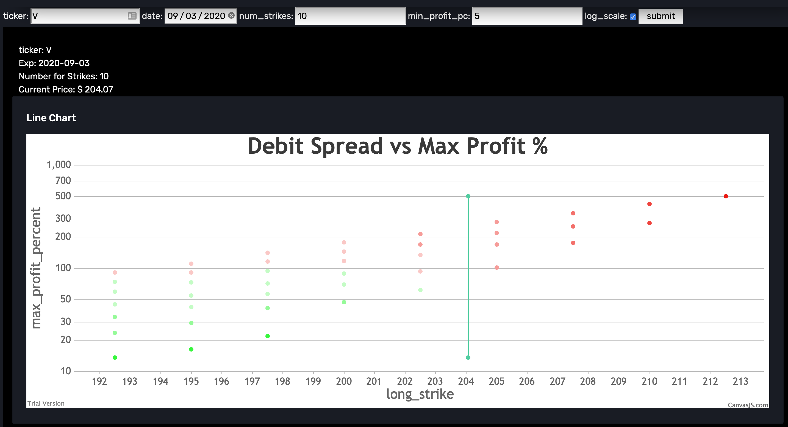

This project started as a way to give me better interface for robinhood I had few features in my mind like:
1) options vs shares vs cash allocation.
2) include gold/silver and derative ETFs in cash
3) give me pie chart of allocation for various tickers in my portfolio.
4) historical data of daily/weekly/monthly profit loss
5) and many more.

However apart from displaying current portfolio, other features like calculating historic profit loss is been tough and I am working on it less frequently right now. Other than robinhood integration I also started working on side tool (and possible more to come) debit spread chart. This basically gives me for a given stock and date what debit spread would yeild what max profit. So I have changed default page to point to debit spread chart.



Anyways here is rest of the readme. This project was cloned from https://github.com/app-generator/django-dashboard-corona-dark but then I changed the remote url to point to my empty repo, that is why I now have lost fork connection. The reason I did this was because initially I was not careful about checking in robinhood credentials and accidently uploaded to github once and twice. I need to make the repo private which was not allowed for a forked repo. Since then I have fixed robinhood credential reading mechanism so that I dont accidently check it in.

## How to use it

```bash
$ # Get the code
$ git clone https://github.com/ArrrNeo/django-dashboard-corona-dark.git
$ cd django-dashboard-corona-dark
$
$ # Virtualenv modules installation (Unix based systems)
$ virtualenv env
$ source env/bin/activate
$
$ # Virtualenv modules installation (Windows based systems)
$ # virtualenv env
$ # .\env\Scripts\activate
$
$ # Install modules - SQLite Storage
$ pip3 install -r requirements.txt
$
$ # patch pyrh library. this is one of the robinhood access library patched to avoid asking for SMS everytime
$ ./patch_pyrh_lib.sh
$
$ # Create tables
$ python manage.py makemigrations
$ python manage.py migrate
$
$ # if you want to reset database you can later run
$ ./reset-db.sh
$
$ # create username.txt and password.txt files inside app folder.
$ # these files will not be uploaded to git and are gitignored
$ # if you dont want to use portfolio feature yet, no need for above step

$ # Start the application (development mode)
$ python manage.py runserver # default port 8000
$
$ # Start the app - custom port
$ # python manage.py runserver 0.0.0.0:<your_port>
$
$ # Access the web app in browser: http://127.0.0.1:8000/
```

## Credits & Links

- [Django](https://www.djangoproject.com/) - The offcial website
- [Original repo](https://github.com/app-generator/django-dashboard-corona-dark) - App Generator

<br />
